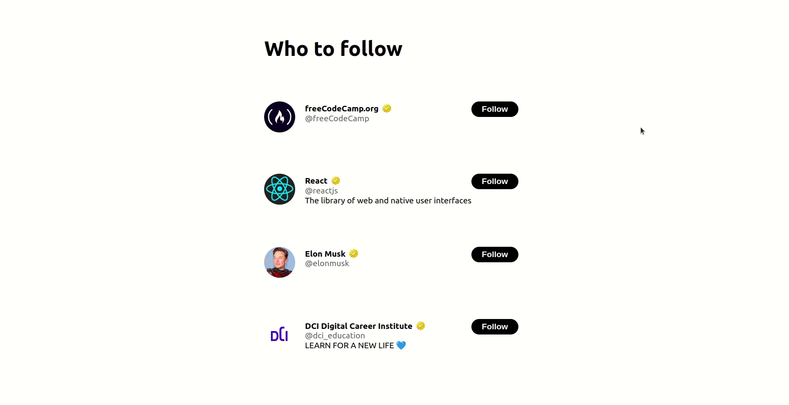

# Twitter feature

The tech team at Twitter has introduced some new features.

Unfortunately the "who to follow suggestions" for the users stopped working since the last update.

Elon has assigned a ticket to you to rewrite the frontend code for this part of the program.

-----------------------------------------------------------------
### hint

For the avatar use the following code as src attribute for the img
```javascript
  src={`https://unavatar.io/twitter/${userName}`}
```



### :weight_lifting: Bonus

add unfollow option

### Happy Coding! 
